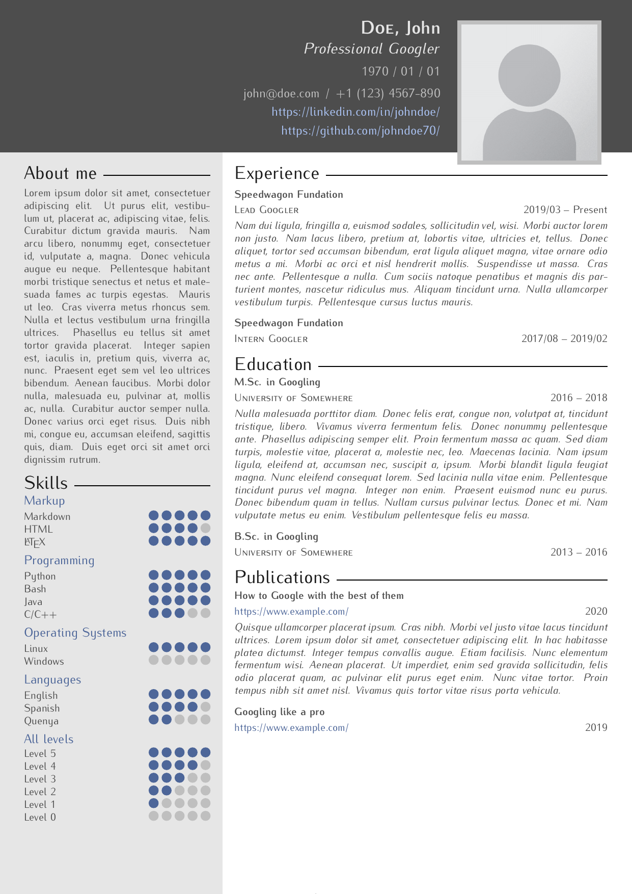

<!----------------------------------------------------------------------------->
<!-- Readme for GitHub repo.                                                 -->
<!--                                                                         -->
<!-- Author:   Kip (https://github.com/kip93/).                              -->
<!-- Source:   https://github.com/kip93/resume/                              -->
<!-- License:  BSD 3-Clause                                                  -->
<!-- Created:  2020-09-27                                                    -->
<!-- Updated:  2021-01-07                                                    -->
<!----------------------------------------------------------------------------->

# My own LaTeX Résumé template

<!-- Mostly constant stuff. Cache of a year for the first 2, and an hour for the rest. -->

<!-- Let's be honest, no need to update these very often either. Cached for 15 minutes. -->

<!-- Relatively "volatile" badges. Cached for a minute. -->

A LaTeX Résumé template designed for my own use, and released under the
[BSD-3-Clause license](./LICENSE) for everyone to enjoy.

## Preview

Here is an example of how the final résumé looks.

<!-- God damn, Jimmie! This is some serious gourmet shit! -->

(Configuration for this example can be found [here](./example.tex))

## How to use

<!-- No clue on how to do this on Windows :/ -->
<!-- * Freedom penguin noises intensify * )? -->
These instructions assume that you are using a Unix based system (OSx, Linux,
BSD, et cetera) and that you have a full TeX distribution set up (if you don't
have one, I recommend [TeX Live](http://tug.org/texlive/)).

1. Open a terminal emulator.
2. Clone this repo (e.g. `git clone https://github.com/kip93/resume.git my_cv`).
3. Enter the new directory (e.g. `cd my_cv`).
4. Create a copy of [example.tex](./example.tex)
   (e.g. `cp example.tex my_cv.tex`).
5. Change the contents of the copied file to your hearts desire, using your
   text editor of choice.
6. Compile the résumé (e.g. `pdflatex my_cv.tex`).
7. Done, your résumé is now ready (e.g. my_cv.pdf).
8. You can always go back to step #5 to change anything you need (e.g. new
   academic studies).

## How to customise

You might want to change stuff like colours or positioning of elements. In that
case, you will need to edit the [resume.cls](./resume.cls) file. Note that
depending on what you want to change this will end up being much more advanced
task than simply editing the `.tex` file described in the previous section.

I've tried to add documentation and comment the file wherever possible, but
you'll need to have at least a good grasp on the LaTeX basics to be able to
make any significant edits.<!-- i.e. May the force be with you. -->

## Dependencies

These are the dependencies for this project, as well as which versions they were
used. Older versions might still work, but are untested.

 * [TeX Live](https://www.tug.org/texlive/) >= `2020` (or other TeX
   distribution, with the packages defined beneath)
   * [etoolbox](https://ctan.org/pkg/etoolbox) >= `2.5k`
   * [pdfcomment](https://ctan.org/pkg/pdfcomment) >= `2.4a`
   * [textpos](https://ctan.org/pkg/textpos) >= `1.10`
   * [TikZ](https://www.ctan.org/pkg/tikz) >= `3.1.7a`
   * [xcolor](https://ctan.org/pkg/xcolor) >= `2.12`
   * [xstring](https://ctan.org/pkg/xstring) >= `1.83`
 * [Poppler utils](https://poppler.freedesktop.org/) >= `20.09` (only needed to
   create the example screenshot)
 * [GNU Make](https://www.gnu.org/software/make/) >= `4.3` (only to be able to
   use the [Makefile](./Makefile) to build the example)

## Attributions

These are external resources used for creating this template.

 * The [placeholder profile picture](./example.png) is taken from
   [here](https://commons.wikimedia.org/wiki/File:Portrait_Placeholder.png) and
   is freely available through the
   [CC BY-SA 4.0](https://creativecommons.org/licenses/by-sa/4.0/deed.en)
   license.
 * Many parts of this template were ~~stolen from~~ inspired by other great
   LaTeX templates, all of which are worth checking out:
   * [posquit0's](https://github.com/posquit0)
     [Awesome CV](https://github.com/posquit0/Awesome-CV)
     ([CC BY-SA 4.0](https://creativecommons.org/licenses/by-sa/4.0/deed.en)
     license).
   * [spagnuolocarmine's](https://github.com/spagnuolocarmine)
     [Twenty Seconds Curriculum Vitae](https://github.com/spagnuolocarmine/TwentySecondsCurriculumVitae-LaTex)
     ([MIT](https://github.com/spagnuolocarmine/TwentySecondsCurriculumVitae-LaTex/blob/master/LICENSE)
     license).
   * [GiantMolecularCloud's](https://github.com/GiantMolecularCloud)
     [Resume](https://github.com/GiantMolecularCloud/my-resume)
     ([CC BY-SA 4.0](https://creativecommons.org/licenses/by-sa/4.0/deed.en)
     license).
